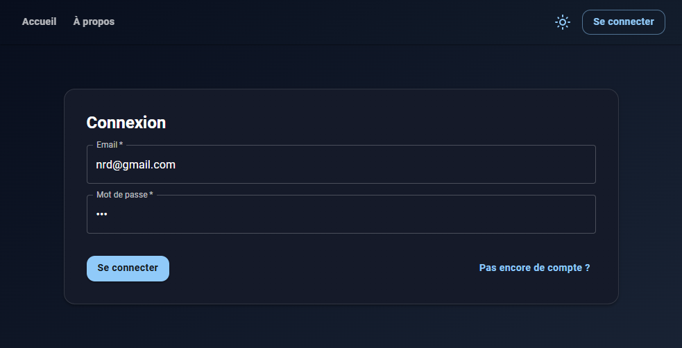
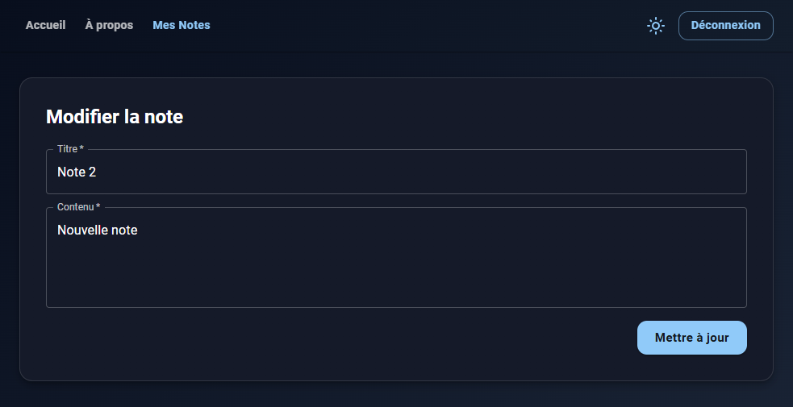
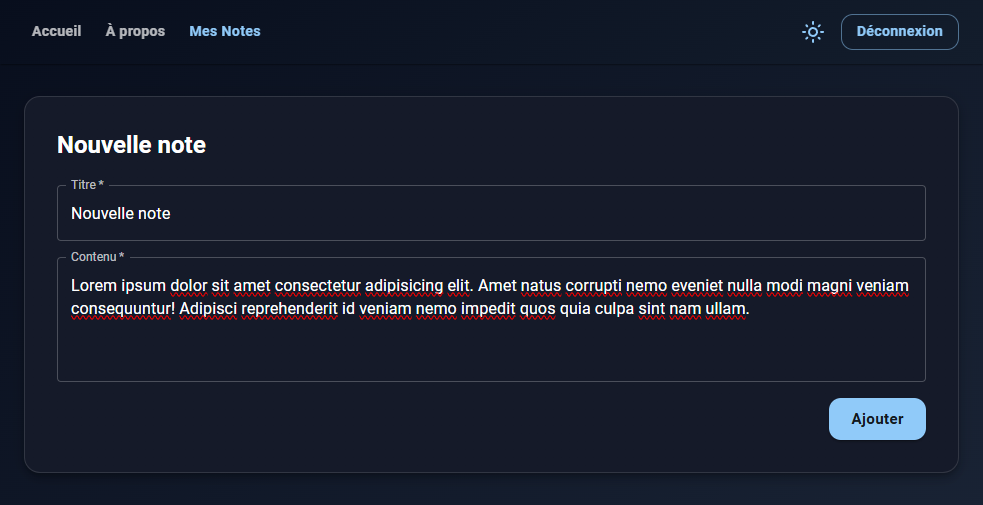

## Exerice 6 Application de Notes Sécurisées (React + Routing + JWT)

## db ==> jdbc:h2:mem:notesdb
## docker run -d -p 8080:8080 christopheutp/note-backend

### Objectif

Créer une **application React multi-pages** permettant à un utilisateur authentifié via **JWT** de gérer ses notes (CRUD) en communiquant avec un **backend Spring Boot sécurisé**.
Ce projet aborde le **routing**, les **routes protégées**, la **gestion d’un token JWT**, et l’intégration d’un backend externe.

---

### Fonctionnalités attendues

1. **Authentification**

   * **Login** : formulaire (email + mot de passe) → appel `POST /api/auth/login`.
   * **Register** : page d’inscription → appel `POST /api/auth/register` → auto-connexion.
   * Sauvegarder le **token JWT** dans `localStorage`.
   * Bouton **Déconnexion** → supprime le token et redirige vers `/login`.

2. **Routing multi-pages**

   * `/login` : page de connexion (publique).
   * `/register` : page d’inscription (publique).
   * `/notes` : liste des notes (protégée).
   * `/notes/new` : création d’une note (protégée).
   * `/notes/:id` : édition d’une note existante (protégée).
   * `*` : page 404.

